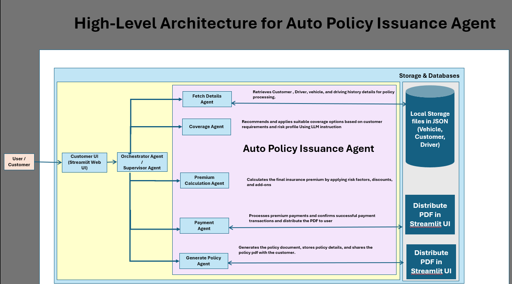
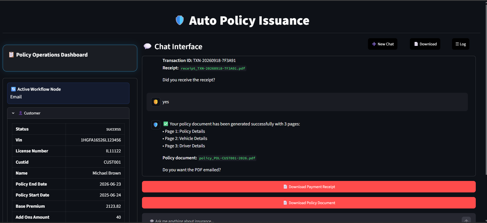

# Auto Policy Issuance Agent

## Problem Statement

The Auto Policy Advisor Agent is designed to automate and streamline the vehicle insurance policy assessment and recommendation process, reducing manual intervention and improving the speed and accuracy of policy issuance.

---

## Solution Overview

The Auto Policy Advisor Agent helps simplify and speed up the vehicle insurance policy process.

It collects and reviews customer, driver, vehicle, and accident-history information in one place.

The agent identifies the important factors that may affect the customer's policy and premium.

It then suggests suitable coverage and policy options based on the customer's details and applicable guidelines.

Customers can discuss their options through a simple conversational chat interface and choose the plan that best fits their needs.

The system also handles key steps such as premium calculation, payment, policy document generation, and email communication.

This reduces the amount of manual work required by insurance teams and helps avoid common data-entry and calculation errors.

Overall, the solution makes the policy assessment and issuance process faster, simpler, and more consistent for both customers and insurance teams.

---

## Technology Stack

Programming Language: Python 
AI / LLM: OpenAI GPT-5.6 Luna 
Agent Framework: LangGraph 
AI Tool Calling: LangChain Tools / Function Calling 
User Interface: Streamlit 
Data Storage: Local JSON files 
Document Generation: ReportLab (PDF) 
Email: Gmail / SMTP 
Configuration: Python .env / Environment Variables

---

## Architecture Diagram



> Higher level Architecture diagram of the Multi Agent Application

Also PDF is provided

---

## Setup Instructions

for local set up and run please follow the below steps:

### 1. Create a virtual environment

**Windows:**

```powershell
python -m venv .venv
.venv\Scripts\activate
```

**Linux/macOS:**

```bash
python -m venv .venv
source .venv/bin/activate
```

### 2. Install dependencies

```bash
pip install -r requirements.txt
```

### 3. Configure API Key

Copy `.env.example` to `.env` and set:

```text
OPENAI_API_KEY=your_key
OPENAI_MODEL=gpt-5.6-luna
```

### 4. Run

From the repository root: (Policy_Agent\Policy_Agent>)

```bash
streamlit run ui.py
```
Example Prompts:  shared in Example_prompts.txt file
---

## Sample Inputs

```text
Auto_Policy_Advisor_Agent/data/
├── customers.json
├── vehicles.json
├── drivers.json
├── accidents.json
├── driver_history.json
└── payments.json
```

---

## Sample outputs



> sample outputs of generating payment and policy pdf documents.

---

## Key Design Decisions

1. End-to-end policy automation

Cover the complete journey from customer/vehicle details and risk assessment to coverage recommendation, premium calculation, payment, policy generation, and email.

2. Agent-based workflow

Use separate agents/nodes for each major functionality, with clear routing between them based on the customer's response and process status.

3. AI + business rules

Use the LLM for understanding customer information and generating recommendations, while predefined insurance rules and tools handle calculations and other actions consistently.

4. Simple and practical implementation

Use LangGraph + Streamlit + local data, with PDF generation and email support, avoiding complex enterprise integrations for the capstone.

---

## Limitations

1. Occasional AI hallucination

The model may sometimes generate incorrect or unexpected information, so important policy decisions should still be reviewed by a human.

2. Local email attachment limitation

In the local setup, PDF files are generated on the user's machine, and the email functionality may occasionally fail to attach these local files correctly.

3. Cloud deployment dependency

The email attachment issue can potentially be addressed in a cloud environment by storing generated PDFs in a shared cloud location and attaching them from there.

4. Prototype limitation

The solution uses local/sample data and simulated payment for the capstone, so it is not directly connected to a production insurance or payment system.
